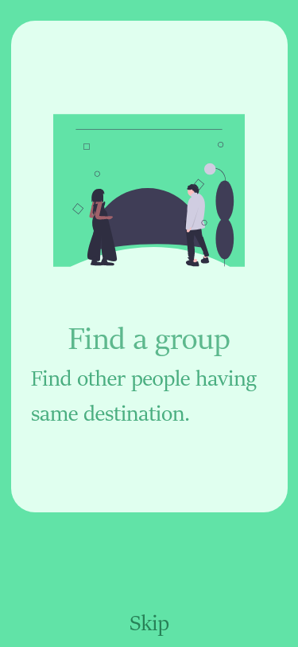
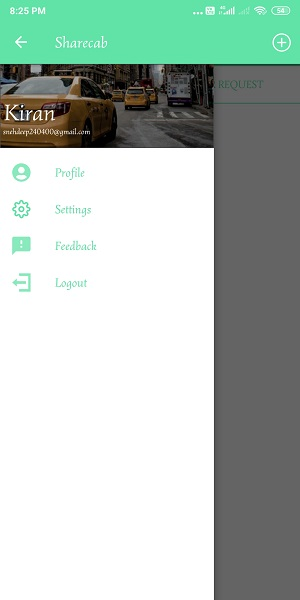

# Sharecab
This is one of my main project where you can pre share your cab with the persons with same preferences. Firebase backend is used for login and information storage. 

Splash Screen

Onboarding screens

Login

<b>Signup</b>

<b>HomePage</b>

 The home page is made with tab layout and menu items

<b>Navigation drawer</b>

